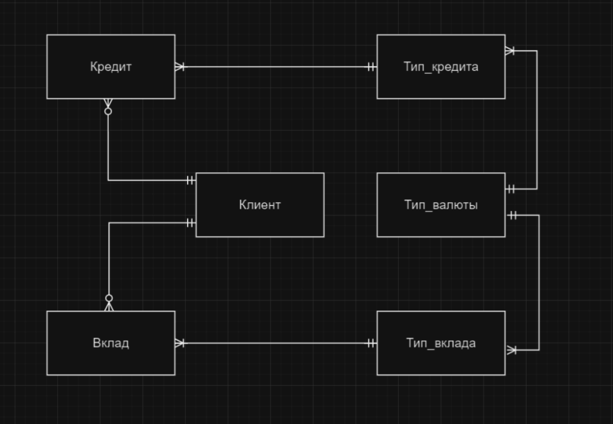
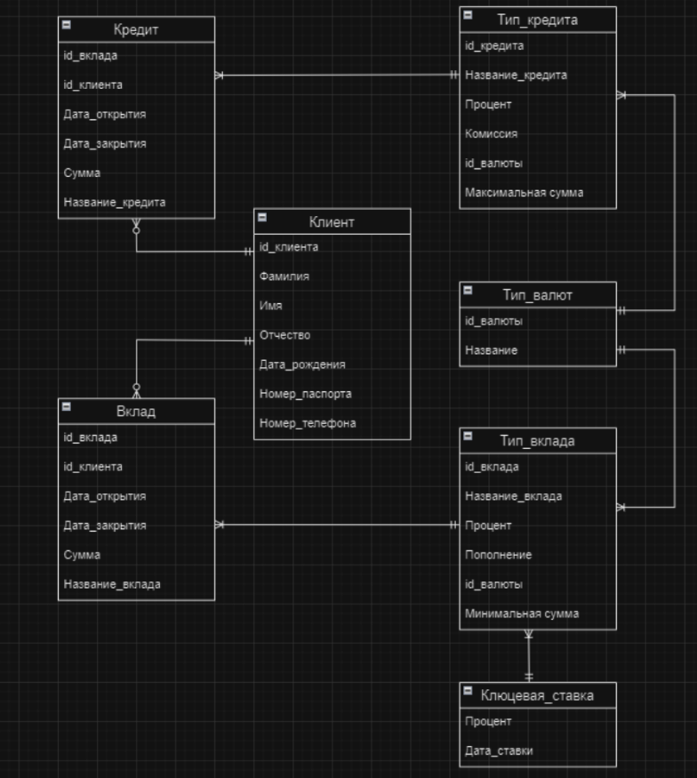
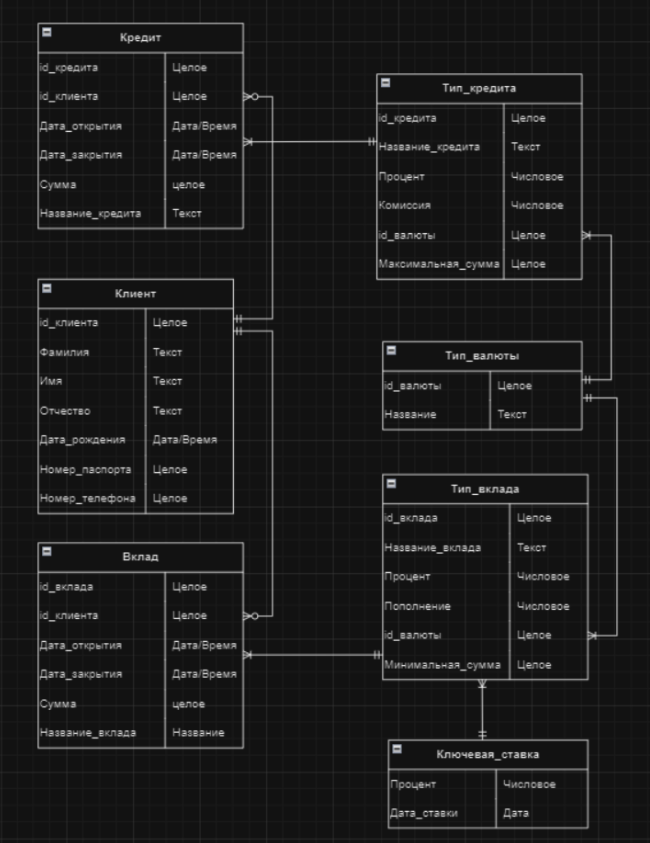

# MIPT_Database

## Концептуальная модель
Данная концептуальная модель представляет собой часть банковской системы.

## Логическая модель 
При создании логической модели была добавлена таблица с версионными данными (Ключевая ставка). Добавление этой таблицы делает модель более реалистичной. Данная модель соответствует третьей нормальной форме, это видно из таблиц “Кредит → Тип кредита → Тип валюты” и “Вклад → Тип Вклада  → Тип валюты”.

[DDL-script](src/ddl.sql)

## Физическая модель

### [Credit Tabble](src/credit_dml.sql)

| Название поля | Тип         | Ограничения                              |
| ------------- | ----------- | ---------------------------------------- |
| credit_id     | BIGSERIAL   | NOT NULL, PRIMARY KEY                    |
| client_id     | BIGINT      | NOT NULL, FOREIGN KEY, REFERENCES client |
| opening_date  | DATE        | CHECK (closing_date > opening_date)      |
| closing_date  | DATE        | CHECK (closing_date > opening_date)      |
| credit_summ   | INTEGER     | NOT NULL, CHECK (credit_summ > 0)        |
| credit_name   | VARCHAR(30) | NOT NULL, UNIQUE, REFERENCES credit_type | 

### [Deposit Tabble](src/deposit_dml.sql)

| Название поля | Тип         | Ограничения                               |
| ------------- | ----------- | ----------------------------------------- |
| deposit_id    | BIGSERIAL   | NOT NULL, PRIMARY KEY                     |
| client_id     | BIGINT      | NOT NULL, FOREIGN KEY,  REFERENCES client |
| opening_date  | DATE        | CHECK (closing_date > opening_date)       |
| closing_date  | DATE        | CHECK (closing_date > opening_date)       |
| deposit_summ  | INTEGER     | NOT NULL, CHECK (deposit_summ > 0)        |
| deposit_name  | VARCHAR(30) | NOT NULL, UNIQUE, REFERENCES deposit_type | 

### [Client Tabble](src/client.sql)

| Название поля   | Тип         | Ограничения                                     |
| --------------- | ----------- | ----------------------------------------------- |
| client_id       | BIGSERIAL   | NOT NULL, PRIMARY KEY                           |
| first_name      | VARCHAR(50) | NOT NULL                                        |
| second_name     | VARCHAR(50) | NOT NULL                                        |
| last_name       | VARCHAR(50) | NOT NULL                                        |
| hb_data         | DATE        | NOT NULL                                        |
| passport_number | VARCHAR(10) | NOT NULL, CHECK (LENGTH(passport_number) == 10) |
| phone_number    | VARCHAR(11) | NOT NULL CHECK (LENGTH(phone_number) == 11)     | 

### [Credit_type Tabble](src/credit_type_dml.sql)

| Название поля   | Тип         | Ограничения                              |
| --------------- | ----------- | ---------------------------------------- |
| credit_id       | BIGSERIAL   | NOT NULL, PRIMARY KEY                    |
| credit_name     | VARCHAR(30) | NOT NULL, UNIQUE                         |
| percent         | FLOAT       | NOT NULL, CHECK (percent > 0)            |
| commission      | FLOAT       | NOT NULL                                 |
| currency_id     | INTEGER     | NOT NULL                                 |
| max_summ        | INTEGER     | NOT NULL                                 | 

### [Deposit_type Tabble](src/deposit_type_dml.sql)

| Название поля   | Тип         | Ограничения                              |
| --------------- | ----------- | ---------------------------------------- |
| deposit_id      | BIGSERIAL   | NOT NULL, PRIMARY KEY                    |
| deposit_name    | VARCHAR(30) | NOT NULL, UNIQUE                         |
| percent         | FLOAT       | NOT NULL, CHECK (percent > 0)            |
| replenishment   | FLOAT       | NOT NULL                                 |
| currency_id     | INTEGER     | NOT NULL                                 |
| min_summ        | INTEGER     | NOT NULL                                 | 

### [Currency_type Tabble](src/currency_type_dml.sql)

| Название поля | Тип         | Ограничения      |
| ------------- | ----------- | ---------------- |
| currency_id   | BIGSERIAL   | NOT NULL         |
| currency_name | VARCHAR(20) | NOT NULL, UNIQUE |

### [Key_rate Tabble](src/key_rate_dml.sql)

| Название поля | Тип         | Ограничения      |
| ------------- | ----------- | ---------------- |
| percent       | FLOAT       | NOT NULL         |
| rate_data     | DATE        | NOT NULL         |
